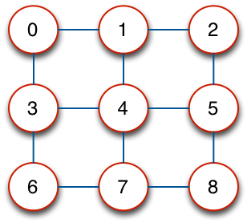
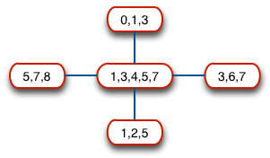
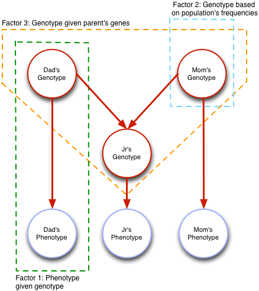
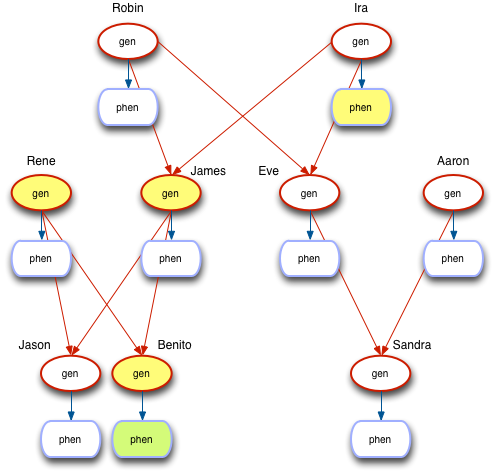
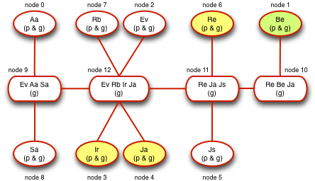
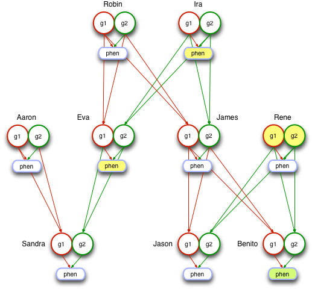
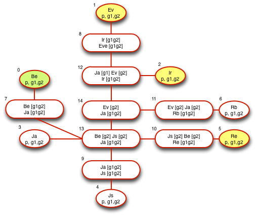

PRIMO
====

## Probabilistic Inference Modeling with Ruby


[](https://coveralls.io/r/sotoseattle/Primo)
[](https://gemnasium.com/sotoseattle/Primo)
[](https://codeclimate.com/github/sotoseattle/Primo)


In 2013 I took the online course "Probabilistic Graphical Models" (Stanford, Prof. Daphne Koller) from [Coursera.org](https://www.coursera.org/course/pgm). It was complex, difficult but a lot of fun because of all the possibilities this field opens up. This gem is a liberal translation of the code I worked with in Octave throughout the course and that I used to learn python during 2013.

I have decided to code in Ruby instead of Python for two reasons: i) Ruby is more flexible when building prototypes and ii) the apps that I would like to build around this inference engines will require a flexibility and abilities on which Ruby shines. If I was obsessed only with the engine per-se I would code it in Julia or heave forbid C, but I am in this for the fun and the possibilities, and Ruby is a pleasure to play with.

Sincere thanks to Masahiro Tanaka for his wonderful [NArray gem](http://masa16.github.io/narray/), which allows me to, for example, to multiply two multi-dimensional arrays element-wise in a single step, after aligning them with simple rotations of their axes (actually pretty cool).

I have christened this working library PRIMO (Probabilistic Inference Modeling) because in Spanish it means either prime, first, cousin or dumb! :)

Table of Contents
=================

- [Primo](#primo)
- [Table of Contents](#table-of-contents)
- [Install](#install)
- [API](#api)
    - [Random Variable](#random-variable)
    - [Factor](#factor)
    - [Factor Array](#factor-array)
    - [Node](#node)
    - [Graph](#graph)
    - [Tree](#tree)
    - [Induced Markov](#induced-markov)
    - [Clique Tree](#clique-tree)
- [Genetic Examples](#genetic examples)
- [Authors](#authors)
- [License](#license)

Install
=======

Clone the git repo from github, move to the cloned root directory and install:

```bash
gem install ./soto-primo-0.0.1.gem
```

- It works with Ruby 2.1.2.
- The main dependency is the [NArray gem from Masahiro Tanaka](http://masa16.github.io/narray/), version 0.6.
- The test are written for RSpec 3.1.2.

To use it in your code add to your Gemfile:

```ruby
# Gemfile
gem 'soto-primo'
```

And require it in your code:

```ruby
# your code
require 'primo'
```

API
===

Random Variable
----------------

The essential building block of Primo, similar to Nodes in graphs, each holds the following instance variables:

- **cardinality**. For example, a binary variable that can only take two values (true-false, 0-1) and therefore it has a cardinality of 2. The roll of a dice would have cardinality of 6, because the the outcome can take 6 different values: 1, 2, 3, 4, 5 or 6.
- **ass** (assignments). An ordered array with all the possible assignments. If no assignments are given it uses integers starting from 0. The previous dice roll would have an ass of [0, 1, 2, 3, 4, 5]; a binary variable would have an ass of [0, 1]. We can also make a binary random variable for the health of a patient with the assignment array ['healthy', 'sick'].
- **name**. Just a name to make it easier to identify the variable.

An important detail is how we define the <=> operator because we will be comparing between random variables based on their internal object ids. This is necessary because later on, when we multiply sets of variables, we will do it according to their order. The order itself doesn't matter, all we'll need is that there is a way to order them in a stable, immutable and persistent way.

```ruby
  def initialize(args)
    args.merge(name: '', ass: nil)

    @card = args[:card].to_i
    @name = args[:name].to_s
    @ass = args[:ass] ? Array(args[:ass]) : [*0...@card]

    fail ArgumentError if @card == 0 || @ass.size != @card
  end

  def <=>(other)
    object_id <=> other.object_id
  end
  ...
end
```

Factor
-------

The best way to visualize a Factor is in terms of an n-dimensional matrix. Each dimension (or axis) corresponds to a random variable. These variables are held in the `@vars` instance variable.

Each axis has as many possible values as its cardinality. A Factor made of two binary variables (x, y) will be similar to a 2x2 matrix.

For example, let's say we have two coins, one true and one biased. We declare two random variables that represent the toss of each coin, both being binary (head or tails). Then we can create for each variable a factor with the following characteristics:

- each factor holds a single random variable
- each factor, in tabular form shows the possible outcomes (assignments) and values (probabilities)

We compute the joint probability table as a factor that holds both variables, so in tabular form we have now 4 different outcomes (possible outcomes) and 4 different values (probabilities of each assignment).

<p align="center">
  
</p>
<br>

So we see that a factor's state includes both

- the set of variables it holds `@vars` kept in an array.
- the values of all possible outcomes `@vals`, stored in an N-array, a multidimensional array, where each dimension correspond to a random variable.

### Operations

#### Marginalization

We want to eliminate a dimension, (a variable or axis), by adding all values along the eliminated axis. In our coins example, given a factor with two variables (true coin and biased coin), if we now want to marginalized the biased coin we end up with a new factor that only holds the variable of the true coin (A), and whose probabilities are computed adding up probabilities of the eliminated variable.


<p align="center">
  
</p>
<br>

We alias the method to the modulus operator `%` for syntactical convenience. This method also allows for chaining operations i.e. f1 % v1 % v2 eliminates in order, first v1 from f1, and then v2 from the resulting factor. Each time % kicks in, f1 is modified in place.

Another example from a multidimensional array perpective. The following factor f1, has only those two random variables (v1, v2), reducing on v2 means selecting the axis for v2 and for each row of v1, adding up all columns of v2.

<p align="center">
  
</p>
<br>

The method marginalize_but is a fast implementation of marginalizing in bulk for all variables in the factor except for one that we want to extract. In this operation we end up with the final probabilities of all assignments for that selected random variable.

#### Multiplication and Addition

Let's begin by saying that like the previous operations these methods:

- modify the first element ( a * b => a is changed)
- allow multiplying/adding by number (element-wise) or factor
- override the common operators (* == multiply factors, + == add factors)
- returns itself so we can chain operations (f1 * f2 * f3)

Although not very syntactically proper, the design decision of writing f1 * f2 as a bang method and modifying f1 in place makes sense in terms of clarity and speed when we later operate multiple times on large sets of factors.

The key methods. Given two factors I modify each one by:

- gathering all the variables of the resulting multiplication factor (union of all sorted variables)
- inserting new axis in each factor for each new variable that it doesn't have. This way both factors will have the same axes, in the same order (by the way, this is the reason why we needed a way to sort random variables by id). This is accomplished with simple rotations of the NArray.
- expanding the values ndarray on each new axis by simply repeating existing values a number of times equal to the cardinality of the axis variable.

Continuing with the graphic example, to expand our previous factor (variables v1 and v2) by another variable (v3) we would start with the 2D values along axes v1, v2. Then we add a third dimension for v3.

<p align="center">
  
</p>
<br>

And then we repeat the 2D matrix (v1,v2) along the v3 axis. In our case v1 and v2 have cardinality 2 and v3 has cardinality 3 so we repeat the 2D matrix twice more along the v3 axis.

<p align="center">
  
</p>
<br>

At the end of the process we have two NArrays that represent the same variables, aligned and of the same shape. To multiply/add we only need to multiply/add them element wise. At the end of the day, this Ruby method is 30% smaller and yet faster than the python version.

```ruby
[:*, :+].each do |o|
  define_method(o) do |other|
    other.is_a?(Numeric) ? self.vals = vals.send(o, other) : modify_by(other, &o)
    self
  end
end

def modify_by(other)
  return self unless other

  all_vars = [*vars, *other.vars].uniq.sort
  new_narray = yield(self.grow_axes(all_vars), other.grow_axes(all_vars))

  self.vars = all_vars
  self.vals = new_narray.reshape!(*cardinalities)
  self
end

def grow_axes(whole_vars)
  return vals.flatten if vars == whole_vars

  multiplier = 1.0
  new_vars = whole_vars.reject { |rv| vars.include?(rv) }

  old_order_vars = [*vars, *new_vars]
  new_order = whole_vars.map { |e| old_order_vars.index(e) }

  new_cards = cardinalities(new_vars)
  multiplier = new_cards.reduce(multiplier, :*)

  flat = [vals.flatten] * multiplier
  na = NArray.to_na(flat).reshape!(*vals.shape, *new_cards)

  if new_order != [*(0..whole_vars.size)]
    na = na.transpose(*new_order)
  end

  na.flatten
end
```

#### Reduction

Set values to 0.0 based on observed variables. For example, given a random variable of color that can only take two possible values (red, blue).i If we know that the color is red, then p(blue)=0.0.

In our coins example, if having the joint probability of variables A and B, we know toss the coin B and see that it is heads, we can modify the joint factor to say that since B was heads, every probability of B being tails should be 0.00. This operation modifies the values (making zero impossible outcomes) but still holds both variables. See how the resulting values are un-normalized and do not add to 1.00.

<p align="center">
  
</p>
<br>

We modify the NArray values by 1) selecting the observed variable axis and leaving all other axis untouched, and 2) for the selected axis, setting to 0. all cells that are not in the observation column.

Factor Array
------------

Just a collection of factors referenced by injection. Inherits from Array and add a couple of utility methods and algorithms applicable to sets of factors:

- **product**
    Returns a new factor as the result of multiplying all factors in the array, essentially a reduction by multiplication with optional normalization.

- **eliminate_variable!**
    Variable Elimination Algorithm that modifies all the factors in place by eliminating a selected variable. It adds the resulting tau to the end of the factor array as another factor, and returns the tau back.

Node
----

The Node is the prototypical graph node that holds:

- a set of random variables in the `@vars` array
- a set of connected nodes in a `@neighbors` array
- a versatile hash for keeping other information, the `@bag`

The public methods called on Nodes are run-of-the-mill:

- `connect` to another node,
- detach from a graph with `isolate` and `isolate?`
- compute the size as the product of cardinalities of its variables (`weight`)


Graph
-----

Refers to an Undirected Graph and it is coded as a module so Objects can adopt behaviors typical of undirected graphs.

Although being a module, it holds by injection a reference to the collection of nodes that form the graph. Also, although the graph coordinates the edges between nodes, it is the node itself the one who knows who he is linked to and actually creates the edge.

Some of the methods included:

- `add_neighbors` or its alias `make_clique` connects with edge two nodes, or multiple nodes as a clique
- `link_between`  connects node to a bunch of others (but not among themselves)
- `link_all_with` makes a clique of all nodes that share a certain variable
- `loneliest_node` returns the node with the least neighbors, useful for min-neighbors algorithm
- `thinnest_node` returns the node with the least cumulative cardinality, useful for min-weight algorithm
- `breadth_first_search_path` Breadth First Search algorithm, returns the path, useful for belief propagation algorithm

Tree
----

Another module that adds to the Graph another bunch of useful methods that apply solely to trees (undirected graphs without loops).

- `leaf` returns the first leaf available in a tree
- `prune` compacts the of nodes in the tree by removing those nodes whose variables are a subset of another node, and re-linking the superset with the subset's neighbors.
  For example, for a simple tree in the form: (ABC)--(BC)--(D), where the A,B,C,D are random variables, () denotes a node and -- an edge. The node (BC) is a subset of (ABC) same so we can compact the tree as => (ABC)--(D)
- `cascade_path` return a message path where each nodes fires only after all neighbors have passed messages. It relies on the discovery path found and returned by the Graph's Breadth First Search.

Induced Markov
--------------

Induced Markov Network is an undirected graph where each node holds a single random variable. It can be created from a set of factors where two nodes become connected if the variables they hold show up together in a factor. Alternatively it can be seen as being created by `moralizing' the Graph derived from a Bayesian Network.

It is used as an intermediary process to create a clique tree from a set of factors.

Clique Tree
-----------

The big kahuna in terms of complexity of all Primo Classes, rivals in importance with the Factor class. In this class many of the modules, methods and objects defined previously fit together to produce our inference engine.

To build a Clique Tree we do three things:

- create a tree of cliques from a set of factors
- prune the tree
- assign the factors to the new nodes as potentials

#### Building a Tree of Cliques

To understand the code we need to understand how Variable Elimination works.

Given a network of random variables (Bayes or Markov) defined by a set of factors the way to do [Variable Elimination](#factor-array) is straightforward:

- Reduce all factors by evidence and have set of factors (F)
- Choose the variable to eliminate (z)
- Gather the factors that have z in their scope
- Multiply them together into a new factor (lambda)
- Marginalize lambda for z to produce tau
- The new set of factors is reduced by the factors 'sum-producted' plus the new one tau
- ... repeat until ...
- the last set of factors we just multiply together and renormalize

The complexity of this algorithm depends linearly on:

- the size of the model (number variables and factors), and
- on the number of variables of the largest factor generated in the process (tau), whose size is in itself exponential in its scope (i.e. 9 binary vars => 2^9).

Therefore, the elimination ordering is the key to the algorithm's efficiency (because the order defines the size of the generated factors).

Graphically, to find the best ordering we:

- transform the directed graph to undirected (from Bayes Net to Induced Markov Net)
- moralize the V structures by connecting the parents. The key being that every factor's scope is represented in the graph, so if I have Factor(A,B,C) => there must be connections between each pair of them: AB, AC, BC.
- as we eliminate variables two things happen:
  - the eliminated variables are removed from the graph (and their links)
  - the resulting scope of the tau must also be reflected in the graph with additional connections! (filled edges). Another way to see it, all the variables connected to the eliminated one, become connected among themselves.

The initial graph plus all the filled edges is called the [Induced Graph](#induced-markov). This graph is very important because:

- every factor produced during VE is a clique in the Induced Graph, and
- every maximal clique in the Induced Graph is factor produced during VE
- an Induced Graph is triangulated (no loops of length > 3 without a bridge)

Ways to find a good ordering are:

1. performing a greedy search using an ad-hoc cost function and at each point eliminate the node with the smallest cost. Examples:
- min-neigbors: pick the node with the minimum number of neighbors (smallest factor),
- min-weight: considering that different variables have different cardinalities it would be better a factor of 10 binary vars than a factor of two vars but each of 100 possible values.
- min -fill: choose vars that create the min amount of new connections (a very good approach),
- weighted min-fill.
2. finding a low-width triangulation of original graph (beyond my reach)

To build a CT we need a list of factors from which we start deriving the set of all random variables and the matrix of edges between them. Then we iteratively run variable elimination choosing as the variable to eliminate the first one with the least edges (min neighbors).

For example, the following Pairwise Markov Grid...

<p align="center">
  
</piv>
<br>

... would create the following clique tree through variable elimination.

<p align="center">
  
</p>
<br>


#### Pruning the Tree

The problem is that many times, the clique tree will be unnecessary big. Many cliques will be subsets of others. It makes sense to collect them together than keep them alive and repeat unnecessary motions. For example, if we have all the info in a clique with variables A,B,C we don't need another clique (node) that holds variables A and B, since the first one already has it all. We can create a more compact and efficient tree if we prune these unnecessary nodes.

The process is not complicated: Go over all the nodes of the tree one at a time. For each one get its connected nodes (neighbors) and go through them. If the variable set of the node under study is a strict subset of the variable set of one of its connected neighbors we can prune the subset node. The key step is to reconnect the superset node to all the other neighbors of the subset node. Then we just delete the subset node and its associated row and column from the edges matrix.

For example, imagine the following clique tree:

ABC --- AB --- AE

Let's say we start with AB. We scan through its neighbors (ABC, AE) and find that AB is a subset of ABC. So we cut off the edges connected to AB and add an edge between ABC and all of AB's other neighbors (in this case just AE). This maintains the running intersection property and compacts the clique tree which now looks like: ABC -- AE.

#### Initializing Potentials

So far we have a tree of nodes but we still need the factors that will add the values to process. We do have factors (from which we created the tree), now we need to assign those factors to the right nodes, and we refer to these as potentials. We do it in two steps.

First, we create factors/potentials for each node, with all values initialized to one. Then for each factor in the input factor list, we choose the first node whose variable set holds all the factor's variables, and the node's potential becomes the factor product of the node's potential itself and the newly assigned factor (remember that we set an innocuous factor of ones beforehand).

If a factor is unassigned we raise an exception.

If a node is factor-less (or one of its variables), there is no problem because we had it already initialized to ones.

And voilá, we have a clique tree.

#### Calibration

After creation the next step is to calibrate it with Belief Propagation. Since our clique tree is an undirected graph we can use the BFS (Breadth First Search) algorithm to give us a correct path for belief propagation.

Here enters the cascade_path we computed from the Breadth First Search algorithm. The private method `message_path` will return the complete path (firing messages sequence) that we'll need for Belief Propagation, traversing the tree both ways.

We follow the schedule and compute for each edge the message (delta_{ij}) passed between nodes C_i and C_j. The method `compute_message` computes the delta as the cumproduct of potential and incoming messages. `incoming_messages` gather incomming messages to the node.

After just two passes, once forward and once backwards throughout the whole tree, we are guaranteed to have achieved calibration. At this moment all the necessary messages (delta) are now computed and we can compute the beliefs (beta) in each node as the product of the initial potential and all its incomming messages.

The key is that having achieved calibration, the exact marginals of all variables coincide independently on which belief/node we marginalize.

#### Querying the Tree

Once calibrated we can query the tree and extract the probability of any variable assignment.

We are looking for the probability of a certain variable, so we find the first node that holds it, we then marginalize the beta inside that node for all its variables except the one we want. The result of the query is then the probability distribution over that variable (result of the marginalization) or a specific value if we have passed along the assignment we want to infere about.


Genetic Examples
================

Included are some examples of Bayesian Genetic Networks and how to compute the probability of specific persons showing a specific phenotype given the family history and genetic observations.

Brute Force Approach
--------------------

First we will study Cystic Fibrosis and the probability that a person will develop CF given its genes.

Given a family tree, for each member of the family we are going to have two nodes, one for the person’s genotype, and another for her phenotype. The template would be:

<p align="center">
  
</p>
<br>

Where the random variables correspond to:

```ruby
class Phenotype < RandomVar
  def initialize(name)
    super(card: 2, name: name, ass: %w(present absent))
  end
end

class Genotype < RandomVar
  def initialize(name)
    super(card: 3, name: name, ass: %w(FF Ff ff))
  end
end
```

And our coded example (cystic_fib_joint_cpd.rb) has the following family tree and set of linked variables.

```ruby
smiths = Family.new(%w(Ira Robin Aaron Rene James Eva Sandra Jason Benito))

simths['James'].son_of(simths['Ira'], simths['Robin'])
simths['Eva'].son_of(simths['Ira'], simths['Robin'])
simths['Sandra'].son_of(simths['Aaron'], simths['Eva'])
simths['Jason'].son_of(simths['James'], simths['Rene'])
simths['Benito'].son_of(simths['James'], simths['Rene'])

smiths.compute_factors
```

<p align="center">
  
</p>
<br>

I will build the factors that bind these variables depending on what genes are inherited and the probabilities of finding them in the general population. Check [here](http://localhost:4000/blog/2013/11/03/Genetic-BN/) to see how exactly I did it.

The main problem is that we are computing probabilities by multiplying factors together, which means creating a CPD for the whole universe of possible assignments of all random variables (nodes). This super table takes into consideration all possible states, all possible scenarios, and therefore is huge.

But before we compute it, we rather simplify things by adding the observations we have. We know that Ira had Cystic Fibrosis, and James and Rene had a genetic test and therefore knew which genes were present in their cases.

```ruby
simths['Ira'].observe_pheno('present')
simths['James'].observe_gen('Ff')
simths['Rene'].observe_gen('FF')
```

Finally we compute the super factor and query it to see the probability of Benito showing symptons.

```ruby
cpd = a.compute_whole_joint
cpd.marginalize_all_but(a['Benito'].phn)
puts "Probability of Benito showing illness: #{cpd['present']}"
=> 0.7 # or 70%
```

Smart Approach
--------------

Running the same Genetic Network for cystic fibrosis using Clique Trees instead of inferring marginals by computing the overall factor product over all the variables (which we saw was exhaustive and intensive), is a much faster approach. (cystic_fib_clique_tree.rb)

The associated clique tree is similar to the following image. All potentials (factors) will hold a handful of variables instead of a multitude of them , and Belief Propagation allows us to query it instantaneously.

<p align="center">
  
</p>
<br>

We only need to create and calibrate the tree given the factors:

```ruby
clique_tree = CliqueTree.new(*all_factors)
clique_tree.calibrate
```

And the probability of the phenotype is computed in a single step:

```ruby
def prob_sick(name)
  variable = self[name].phenotype
  100 * clique_tree.query(variable, 'present')
end
```

In the same manner we can use Clique Trees to compute the example on cystic_fib_decoupled.rb, that has an even bigger joint table because now each gene is decoupled in the following manner:

<p align="center">
  
</p>
<br>

And the Clique Tree that results is still very small and easy to traverse.

<p align="center">
  
</p>
<br>

You can imagine that as we add people, variables and nodes, the only sane way to go about is with Clique Trees. This gem provides the tools to create complex inference based on Bayesian Networks.

Authors
=======

Javier Soto (sotoseattle@gmail.com)

License
=======

The MIT License

Copyright (c) 2013-2014 Javier Soto

Permission is hereby granted, free of charge, to any person obtaining a copy of this software and associated documentation files (the "Software"), to deal in the Software without restriction, including without limitation the rights to use, copy, modify, merge, publish, distribute, sublicense, and/or sell copies of the Software, and to permit persons to whom the Software is furnished to do so, subject to the following conditions:

The above copyright notice and this permission notice shall be included in all copies or substantial portions of the Software.

THE SOFTWARE IS PROVIDED "AS IS", WITHOUT WARRANTY OF ANY KIND, EXPRESS OR IMPLIED, INCLUDING BUT NOT LIMITED TO THE WARRANTIES OF MERCHANTABILITY, FITNESS FOR A PARTICULAR PURPOSE AND NONINFRINGEMENT. IN NO EVENT SHALL THE AUTHORS OR COPYRIGHT HOLDERS BE LIABLE FOR ANY CLAIM, DAMAGES OR OTHER LIABILITY, WHETHER IN AN ACTION OF CONTRACT, TORT OR OTHERWISE, ARISING FROM, OUT OF OR IN CONNECTION WITH THE SOFTWARE OR THE USE OR OTHER DEALINGS IN THE SOFTWARE.
