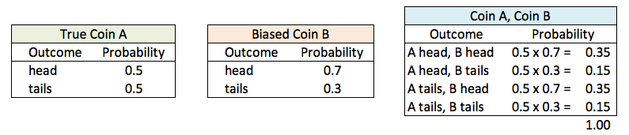
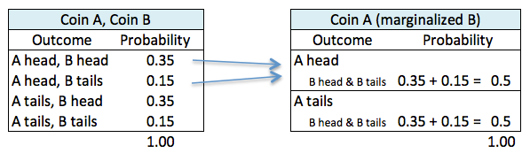
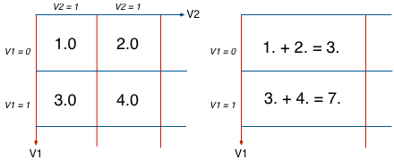
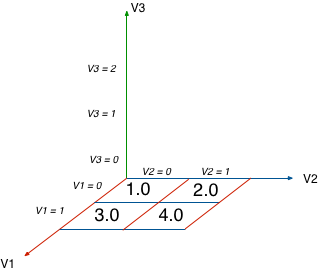
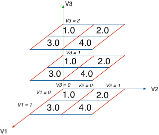
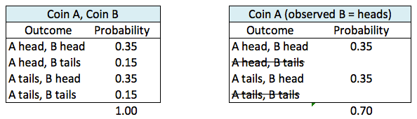

PRIMO
====

## Probabilistic Inference Modelling with Ruby

[]()

Table of Contents
=================

- [Primo](#primo)
- [Table of Contents](#table-of-contents)
- [Install](#install)
- [Intro](#intro)
- [API](#api)
    - [Random Variables](#random-variables)
    - [Factors](#factors)
    - [Factor Array](#factor-array)
- [Examples]()
    - [Genetic Network]()
- [Authors](#authors)
- [License](#license)


Install
=======

It works in Ruby 2.1.2
The main dependency is the [NArray gem from Masahiro Tanaka](http://masa16.github.io/narray/), version 0.6.
The test are written for RSpec 3.1.2.

Intro
=====

In 2013 I took the online course "Probabilistic Graphical Models" (Stanford, Prof. Daphne Koller) from [Coursera.org](https://www.coursera.org/course/pgm). It was complex, difficult but a lot of fun because of all the possibilities it opened up for me. This gem is a liberal translation of the code I worked with in Octave throughout the course.

I have decided to code in Ruby instead of Python (for which I had a previous version) because Ruby is more flexible when building prototypes. The apps that I would like to build around ML are like cars. The engine may be a key component and its performance paramount, but there is more to a car than its engine. These apps will be more than its inference engine, and in all those other aspects Ruby shines. If I was obsessed only with the engine I would have code it in Julia or C, but I am in this for the fun and the possibilities, and Ruby is a pleasure to play with.

Besides, what I have already coded in Ruby is already faster than my Python code (which shows what a beginner I am in Python). The key to the performance boost has been the use of the [NArray gem from Masahiro Tanaka](http://masa16.github.io/narray/), which allows me to, for example, multiply two multidimensional arrays element wise in a single step, after aligning them with simple rotations of their axes (actually pretty cool).

I have christened this working library PRIMO (Probabilistic Inference Modeling) because in Spanish it means either prime, first, cousin or dumb! :)

API
===

Random Variables
----------------

The essential building block of Primo, similar to Nodes in graphs, each holds the following instance variables:

- **cardinality**. For example, a binary variable that can only take two values (true-false, 0-1) and therefore it has a cardinality of 2. The roll of a dice would have cardinality of 6, because the the outcome can take 6 different values: 1, 2, 3, 4, 5 or 6.
- **ass** (assignments). An ordered array with all the possible assignments. If no assignments are given it uses integers starting from 0. The previous dice roll would have an ass of [0, 1, 2, 3, 4, 5]; a binary variable would have an ass of [0, 1]. We can also make a binary random variable for the health of a patient with the assignment array ['healthy', 'sick'].
- **name**. Just a name to make it easier to identify the variable.

An important detail is how we define the <=> operator because we will be comparing between random variables based on their internal object ids. This is necessary because later on, when we multiply sets of variables, we will do it according to their order. The order itself doesn't matter, all we'll need is that there is a way to order them in a stable, immutable and persistent way.

```ruby
  def initialize(args)
    args.merge(name: '', ass: nil)

    @card = args[:card].to_i
    @name = args[:name].to_s
    @ass = args[:ass] ? Array(args[:ass]) : [*0...@card]

    fail ArgumentError if @card == 0 || @ass.size != @card
  end

  def <=>(other)
    object_id <=> other.object_id
  end
  ...
end
```

Factors
-------

The best way to visualize a Factor is in terms of an n-dimensional matrix. Each dimension (or axis) corresponds to a random variable. These variables are held in the `@vars` instance variable.

Each axis has as many possible values as its cardinality. A Factor made of two binary variables (x, y) will be similar to a 2x2 matrix.

For example, let's say we have coins, one true and one biased. We declare two random variables that represent the toss of each coin, both being binary (head or tails). Then we can create for each variable a factor with the following characteristics:

- each factor holds a single random variable
- each factor, in tabular form shows the possible outcomes (assignments) and values (probabilities)

We compute the joint probability table as a factor that holds both variables, so in tabular form we have now 4 different outcomes (possible outcomes) and 4 different values (probabilities of each assignment).

<div style="text-align:center">

</div>

So we see that a factor's state includes both

- the set of variables it holds `@vars` kept in an array.
- the values of all possible outcomes `@vals`, stored in an N-array, a multidimensional array, where each dimension correspond to a random variable.

### Operations

#### Marginalization

We want to eliminate a dimension, (a variable or axis), by adding all values along the eliminated axis. In our coins example, given a factor with two variables (true coin and biased coin), if we now want to marginalized the biased coin we end up with a new factor that only holds the variable of the true coin (A), and whose probabilities are computed adding up probabilities of the eliminated variable.

<div style="text-align:center">

</div>

We alias the method to the modulus operator `%` for syntactical convenience. This method also allows for chaining operations i.e. f1 % v1 % v2 eliminates in order, first v1 from f1, and then v2 from the resulting factor. Each time % kicks in, f1 is modified in place.

Another example from a multidimensional array perpective. The following factor f1, has only those two random variables (v1, v2), reducing on v2 means selecting the axis for v2 and for each row of v1, adding up all columns of v2.

<div style="text-align:center">

</div>

The method marginalize_but is a fast implementation of marginalizing in bulk for all variables in the factor except for one that we want to extract. In this operation we end up with the final probabilities of all assignments for that selected random variable.

#### Multiplication and Addition

Let's begin by saying that like the previous operations these methods:

- modify the first element ( a * b => a is changed)
- allow multiplying/adding by number (element-wise) or factor
- override the common operators (* == multiply factors, + == add factors)
- returns itself so we can chain operations (f1 * f2 * f3)

The key methods. Given two factors I modify each one by:

- gathering all the variables of the resulting multiplication factor (union of all sorted variables)
- inserting new axis in each factor for each new variable that it doesn't have. This way both factors will have the same axes, in the same order (by the way, this is the reason why we needed a way to sort random variables by id). This is accomplished with simple rotations of the NArray.
- expanding the values ndarray on each new axis by simply repeating existing values a number of times equal to the cardinality of the axis variable.

Continuing with the graphic example, to expand our previous factor (variables v1 and v2) by another variable (v3) we would start with the 2D values along axes v1, v2. Then we add a third dimension for v3.

<div style="text-align:center">

</div>

And then we repeat the 2D matrix (v1,v2) along the v3 axis. In our case v1 and v2 have cardinality 2 and v3 has cardinality 3 so we repeat the 2D matrix twice more along the v3 axis.

<div style="text-align:center">

</div>

At the end of the process we have two NArrays that represent the same variables, aligned and of the same shape. To multiply/add we only need to multiply/add them element wise. At the end of the day, this Ruby method is 30% smaller and yet faster than the python version.

```ruby
[:*, :+].each do |o|
  define_method(o) do |other|
    other.is_a?(Numeric) ? self.vals = vals.send(o, other) : modify_by(other, &o)
    self
  end
end

def modify_by(other)
  return self unless other

  all_vars = [*vars, *other.vars].uniq.sort
  new_narray = yield(self.grow_axes(all_vars), other.grow_axes(all_vars))

  self.vars = all_vars
  self.vals = new_narray.reshape!(*cardinalities)
  self
end

def grow_axes(whole_vars)
  return vals.flatten if vars == whole_vars

  multiplier = 1.0
  new_vars = whole_vars.reject { |rv| vars.include?(rv) }

  old_order_vars = [*vars, *new_vars]
  new_order = whole_vars.map { |e| old_order_vars.index(e) }

  new_cards = cardinalities(new_vars)
  multiplier = new_cards.reduce(multiplier, :*)

  flat = [vals.flatten] * multiplier
  na = NArray.to_na(flat).reshape!(*vals.shape, *new_cards)

  if new_order != [*(0..whole_vars.size)]
    na = na.transpose(*new_order)
  end

  na.flatten
end
```

#### Reduction

Set values to 0.0 based on observed variables. For example, given a random variable of color that can only take two possible values (red, blue).i If we know that the color is red, then p(blue)=0.0.

In our coins example, if having the joint probability of variables A and B, we know toss the coin B and see that it is heads, we can modify the joint factor to say that since B was heads, every probability of B being tails should be 0.00. This operation modifies the values (making zero impossible outcomes) but still holds both variables.

<div style="text-align:center">

</div>


We modify the NArray values by 1) selecting the observed variable axis and leaving all other axis untouched, and 2) for the selected axis, setting to 0. all cells that are not in the observation column.

Factor Array
------------

Just a collection of factors referenced by injection. Inherits from Array and add a couple of utility methods and algorithms applicable to sets of factors:

- **product**
    Returns a new factor as the result of multiplying all factors in the array, essentially a reduction by multiplication with optional normalization.

- **eliminate_variable!**
    Variable Elimination Algorithm that modifies all the factors in place by eliminating a selected variable and returns the tau.


Authors
=======

Javier Soto (sotoseattle@gmail.com)

License
=======

The MIT License

Copyright (c) 2013 Javier Soto

Permission is hereby granted, free of charge, to any person obtaining a copy
of this software and associated documentation files (the "Software"), to deal
in the Software without restriction, including without limitation the rights
to use, copy, modify, merge, publish, distribute, sublicense, and/or sell
copies of the Software, and to permit persons to whom the Software is
furnished to do so, subject to the following conditions:

The above copyright notice and this permission notice shall be included in
all copies or substantial portions of the Software.

THE SOFTWARE IS PROVIDED "AS IS", WITHOUT WARRANTY OF ANY KIND, EXPRESS OR
IMPLIED, INCLUDING BUT NOT LIMITED TO THE WARRANTIES OF MERCHANTABILITY,
FITNESS FOR A PARTICULAR PURPOSE AND NONINFRINGEMENT. IN NO EVENT SHALL THE
AUTHORS OR COPYRIGHT HOLDERS BE LIABLE FOR ANY CLAIM, DAMAGES OR OTHER
LIABILITY, WHETHER IN AN ACTION OF CONTRACT, TORT OR OTHERWISE, ARISING FROM,
OUT OF OR IN CONNECTION WITH THE SOFTWARE OR THE USE OR OTHER DEALINGS IN
THE SOFTWARE.
